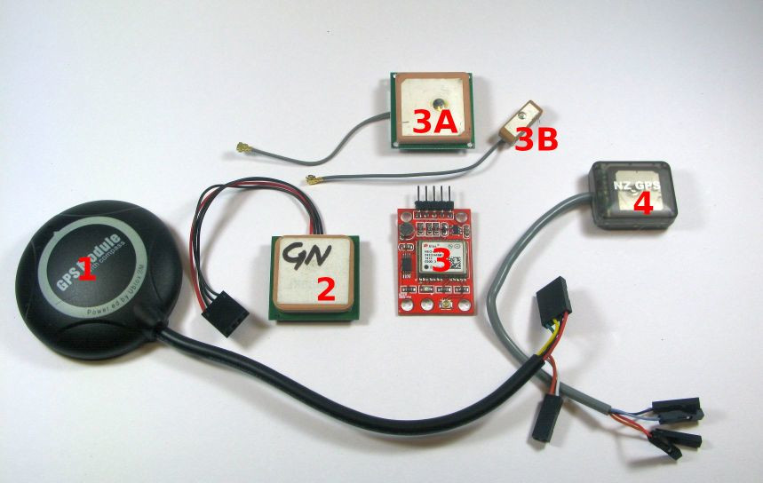
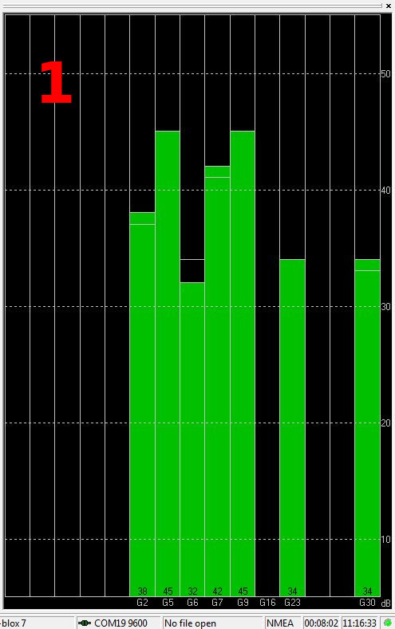
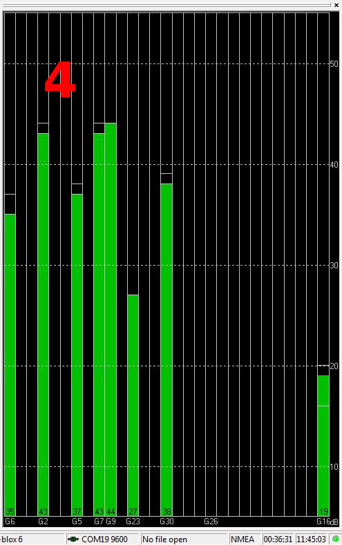
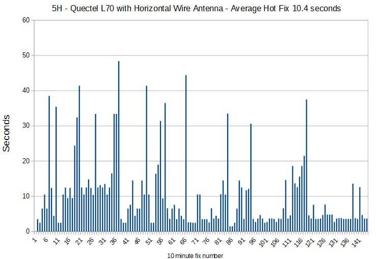
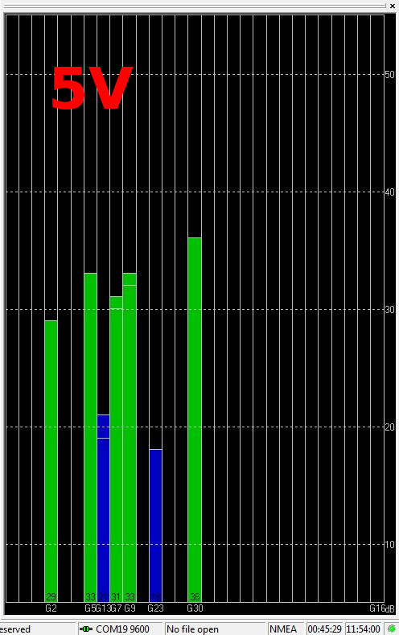
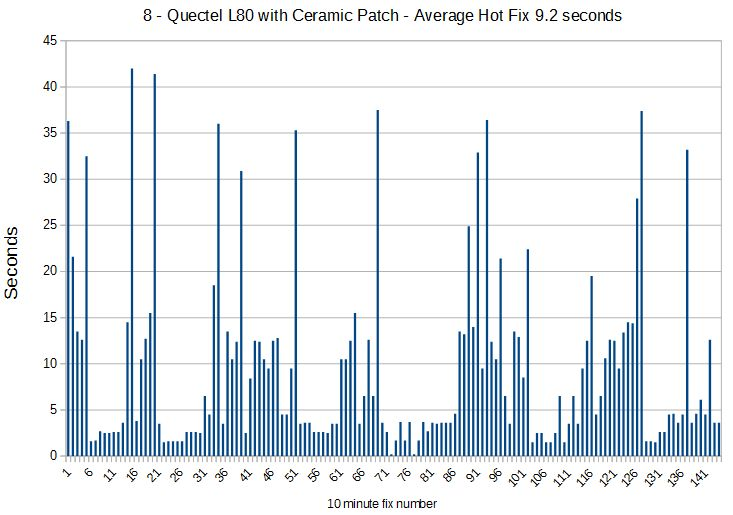

# GPS Performance 

GPS performance is an often overlooked issue. You may spend a lot of time concentrating on designing a GPS project with an extremely low sleep current, without paying attention to the amount of power the GPS uses when it is running, acquiring a fix and when its in backup mode.

If a GPS in 'hot fix' mode consumes 50mA (typical figure) and takes and average of 5 seconds to get a new fix, and you do that every 10 minutes, then in one day it will consume;

50 x 5 x 6 x 24 = 36000maSecs 

or

10mAhr per day. 

Now 10mAhr over a day may not seem a lot, but if the batteries were a pack of AAs then battery life would be less than 280 days.

10mAhr a day is an average current of 416uA, so its rather pointless worrying whether a project consumes 10uA in sleep versus striving for 0.1uA or less. 

### GPS Signal Performance

For each GPS I will measure the signal receiving performance the GPS. For this we will use the Ucenter application which when connected to a GPS produces a chart of satellite received satellites and their signal strengths. GPSs with a good signal performance will achieve initial lock quicker, work better in more marginal conditions and will overall require less power to operate. 

Ucenter uses the NMEA GSV sentence to obtain the signal strengths of the satellites;

*Signal strength, in dB-Hz (0 - 99)
To compare with SNR values found in Bin messages (such as Bin96) subtract 30 from this signal strength value for an approximate SNR value
SS - 30 = SNR (from Bin message)*

A signal level of 26 or lower is marginal and you may not get a fix, or it could take a long time. A value of 40 or more is a strong signal. if a GPS is receiving 3 or more satellites at this signal level or greater then it can be expected to aquire a fix in 30-50 seconds from cold.

The Ucenter application is designed for Ublox GPSs but it will display satellite information for other GPS makes also. 

In the roof of my shed I have a clear plastic panel and I placed the GPSs in turn underneath this on a high shelf. The location was not ideal for good GPS reception but indicative of a slightly marginal situation.

The GPSs were connected in turn and time was given for the GPS to acquire a fix, in some cases the time from cold to first fix was taken and the current consumption was also measured. 

Modern GPSs should when connected to a decent working antenna get a fix from cold in 30 to 60 seconds. If it takes longer either the GPS or its antenna are faulty or the GPS has a poor view of the sky. You may often see it commented that GPSs can take 15 minutes or even longer to acquire a fix from cold. I assume this in an urban myth maybe based on ancient history. All the GPSs I have tested in recent years stick to the 30 to 60 second rule, unless they are faulty. 

### GPS Backup Performance

A modern GPS will normally get a fix from cold in 30 – 60 seconds when it has a good view of the sky. Once it has downloaded enough information on the GPS satellites the main GPS power can be turned off and as long as a voltage is supplied to the GPS backup pin it will retain the satellite information in GPS memory. When the GPS power is then turned back on the GPS can acquire an updated fix in as little as 2 – 5 seconds, this is called ‘hot fixing’.

In backup mode the GPS may consume only 5uA to 20uA, so clearly there are significant power savings to be had if we only want intermittent fixes from the GPS. A GPS that only needs to run for a few seconds to get an updated fix every 10 minutes or longer will use a lot less power that an GPS that is left running all the time.

##### GPS Backup with battery

A very common way to supply the backup supply to a GPS is to use a small Lithium battery, typically a Seiko MS621. However this is not without problems, the MS621 has a capacity of only 5.5mAhr and a max charge current of 100uA. So when first used with the GPS you need to leave it powered for 55 hours, just over two days, to fully charge the battery which is not very convenient. In addition you need to consider the cycle time. A typical NEO version UBLOX GPS will consume 15uA in backup mode, so the MS621 will only last 15 days or so when fully charged. The equivalent Quectel GPSs consume around 6uA in backup mode. If the tracker is to use hot fixing for longer than 15 days then the backup battery needs to be charged, or it will just run out and hot fixing will fail.

If we are taking a GPS fix every 10 minutes and the hot fix takes 5 seconds, there is only 100uA x 5 seconds = 500uA seconds going into the battery. But in 10 minutes there is 10min x 60seconds x 15uA = 9000uA seconds going out. Thus the battery is draining 18 times faster than it is charging and will inevitably discharge quite quickly.

Although fitting an MS621 battery is common with GPS modules, its not suitable as a backup method if the GPS is to be used for a couple of weeks or more. A different backup strategy is needed.

##### GPS Backup with Super Capacitor

If a small lithium battery is not suitable;  what about a super capacitor that can at least be charged fairly quickly so it might accrue enough charge during a short hot fix power on to last for several hours ?

There is a web site which is an online super capacitor charge and discharge calculator;

[Super Capacitor Calculator](https://www.maximintegrated.com/en/design/tools/calculators/product-design/supercap.cfm)

First lets see what size of super capacitor we need. Assume a maximum backup time of one day, a fully charged voltage of 3.0V and a minimum volts for GPS backup of 1.5V, a  GPSs backup current of 15uA which is  typical for a Ublox GPS for instance. The calculator suggests a capacitor of 1Farad would last a couple of hours longer than one day.

If the hot fix gap was 10 minutes and the hot fix takes 5 seconds with a GPS backup current of 15uA, then assuming no charge\discharge efficiency losses the charge current needs to be 600/5 times the backup current or 1.8mA. That’s manageable.

So if we are to use a 1F super capacitor how big would it be ?

Checking on the Farnell web site a 1Farad 3.6V super capacitor would be around 20mm, perhaps a bit more, in diameter and 5mm high. That’s really quite big, see picture for how big the 5.5V version 1F capacitor is. The GPS shown is one of the larger 25mm ceramic patch antenna types.

There are some small super capacitors around the same size as the Seiko MS621, but these super capacitors are of very limited capacity and would only provide a couple of hours backup (based on practical tests).

So if a super capacitor is too big to be practical and we have already dismissed small lithium rechargeables, then what is the alternative ?

##### GPS Backup - What to do ?
 

So if we don’t use a a super capacitor or a small lithium rechargeable, then what is the alternative ?

We could of course use a non-recharegeable lithium battery such as a CR1216 but in the holders these have much the same issue as the super capacitor, they are physically large, see picture.

In addition even a battery as physically big as the CR1216 only has a capacity of circa 25mAhr, so that would only keep the GPS (@15uA backup current) going for 70 days. A tracker based on this setup would need it’s GPS battery replaced around every two months.

The answer to the problem is quite simple really. With the small lithium rechargeable or super capacitor options, then the backup power for the GPS is actually coming from the projects main battery, so why not use the main battery as the backup power source for the GPS ?

All we need to do is take a 3.3V supply from the project and feed this voltage via a diode to the GPS Vbackup supply. We then need to ensure that the 3.3V supply is present when the project (using the GPS) is in sleep mode. This is not difficult even if the project is using something like a TPL5110 to switch off \on the battery supply to the project. A low drop out regulator such as the MCP1711 has a quiescent current of 0.6uA, so that can be used to go between the projects battery and the GPS Vbackup supply without having a significant impact on total GPS backup current consumption.

Whilst the solution to providing a long term GPS backup current is simple to implement, very few GPS breakout boards provide access to the GPS Vbackup pin, so you cannot feed in an external backup supply. For this reason I designed my own GPS breakout boards for the Quectel L70 and L80 GPS. 

 

The L80 GPS has a slightly worse power performance than the L70, but it has its own ceramic patch antenna and easy to include in PCB designs and solder in place, I like it. The L70 has a balloon mode, for use up to 80km.

**Note:** It should be noted that the vast majority of the GPSs modules reported on in this report will, if operated over several weeks, revert to cold fix mode due to failure of the backup supplies, that will in turn significantly increase power consumption. 

### GPS Hot Fix Performance

A 'hot fix' takes place when a GPS is powered on or woken up from a software based sleep mode. If the GPS has a memory backup then it will use the previously downloaded GPS satellite information stored in its memory to quickly establish a new location fix. If there has been little movement across the sky in the GPS satellites that are visible since the last fix, this 'hot fix' can take as little as two seconds. Clearly if the GPS only needs to be on for two seconds this can result in significant power savings. However GPS satellites do move out of view and new ones appear so that over time the GPS will need to download information on new satellites which takes time. Thus whilst initially 'hot fix' times will be very short over a period of hours there will be longer 'hot fix' times, as you will see in the graphs below. 

The only practical way to monitor the actual current consumption of a GPS tracker over a long period is to externally measure the actual mAhr used, if the hot fix time varies a lot its going to be difficult to calculate the figure. As an example it was noted that for one of the UBLOX GPSs used in these tests the hot fix time varied from 2.0 seconds to 32 seconds, its thus very difficult to come up with an average for calculation purposes.   

Some Arduino software was written that powered up the GPS, recorded how long the fix took, powered down the GPS, sent the GPS information at bandwidth 125000hz and SF12 (worse case for long distance) and transmitted the location packet. The tracker was then powered off by a real time clock based **power controller** (DS3231) of my own design. This power controller turned off the tracker for 10 minutes, so this was the GPS location transmission interval. The sleep current for the entire arrangement was 1.5uA. 

In the real World tests described below for a common GPS it was shown that at a 10 minute GPS fix interval the GPS uses 36mAhr of battery power per day. As a comparison, a tracker board with a sleep current of 10uA (a high figure) would use 0.24mAhr of battery power per day, which is an insignificant amount when compared to the power used by the GPS.

A large lead acid gel **battery** feeding a 5V output step down **power converter** was connected to a **USB power meter** which would record the total mAhr being used by the tracker.  

The entire package was placed outdoors in my garden on a table which would be around the height of a tracker worn by a small animal. 

The Arduino receiver software was written for the Pro Mini based LCD reciever of mu own design. It recorded the received packets, including GPS fix time, and reported them to an attached display, serial monitor and micro SD card log. The SD card log format was in CSV so it was straight foward to read to data on the file into a spreadsheet and draw a graph of the variation in fix times. 

**Note:** This report is a work in progress, fix and current data is not yet available for some GPSs.
  
  

### GPS Performance Tests - Report Format

The GPS's were initially tested for signal performance and fix time in 3 batches. Below the testing of each batch is reported starting with a picture of the GPSs. The GPS is named and the information presented in this order, Fix time from cold, current consumption whilst acquiring fix, current consumption after fix, GPS mAhr used in 24 hours, GPSmAhr used per fix. To calculate the power just used by the GPS the consumed by the tracker with no GPS was measured. The total up time was 2.91 seconds with a power consumption of 7.2mA when idle and 44mA when transmitting. The transmit time was 0.925 seconds, this equates to 0.0917 mAhr per hour or 2.2mAhr per day. With that figure known it was possible to subtract the figure from the total measured mAhr when the transmissions and GPS were in use in order to isolate the GPS only figure.     

The GPS signal graph is then shown for the GPS, note that green bars mean the satellite is available for fix information blue means it is not.  At the bottom of the bar is the signal strength, and below that the satellite number. 

If the 24 hour hot fix test has been run that is presented next. This graph shows the variation in hot fix times over a 24 hour period. The fixes are every 10 minutes. 
 

### GPS Tests

This is the first set of GPSs';

And the respective plots from Ucenter were are shown below, GPS 3 is a Ublox6M tested with the large ceramic patch antenna (3A) and the smaller one which is sometimes used (3B).

  

#### 1 - Ublox 7M GPS
Often used on quadcopters and similar, has 25mm ceramic patch antenna inside. 
  

 
  
  
#### 2 - Ublox8 GPS Ceramic Patch
* With 25mm ceramic patch antenna. 
* Fix time from cold, 35 seconds.
* Current whilst acquiring fix, 50mA to 54mA.
* Current after fix acquired, 45mA to 56mA.
* Total Tracker Power in 24 hours, 10 minute fixes, 38.1mAhr
* GPS Power in 24 hours, 10 minute fixes, 35.9mAhr
* Tracker battery life AA Alkalines 73 days

  

  
  

#### 3A - Ublox6M GPS
* With plug in  25mm ceramic patch antenna.
* Fix time from cold, 35 seconds.
* Current whilst acquiring fix, 50mA to 55mA
* Current after fix acquired, 45mA to 55mA
  

  
  
#### 3B - Ublox6M GPS
* With plug in  mini ceramic patch antenna. Much reduced signals. No fix.

  
#### 4 - unknown type.

  
**GPSs 5,6 and 7** below are typical types for high altitude balloon (HAB) tracking, all 3 have a high altitude mode allowing operation above 18,000M

  
  
#### 5H Quectel L70
* With simple horizontal wire antenna.
* Fix time from cold, 32 seconds.
* Current whilst acquiring fix, 14mA to 15mA
* Current after fix acquired, 15mA to 22mA. The L70 is the same size and pin layout as the Ublox MAX8Q.
* Total Tracker Power in 24 hours, 10 minute fixes, 17.6mAhr
* GPS Power in 24 hours, 10 minute fixes, 15.4mAhr 
* Tracker battery life AA Alkalines 159 days

  

  

  

#### 5V Quectel L70
* With simple vertical wire antenna. 
* Fix time from cold, 36 seconds.
* Current whilst acquiring fix, 14mA to 15mA
* Current after fix acquired, 15mA to 22mA

  

#### 6H Ubloz MAX8Q
The standard HAB GPS perhaps.

* With simple horizontal wire.
* Fix time from cold, 5 min 46 seconds.
* Current whilst acquiring fix, 22mA to 28mA
* Current after fix acquired, 20mA to 25mA
  

  
  
#### 6V Ublox MAX8Q
* With simple vertical wire.
* **No fix acquired in 20 mins**. 
* Current whilst acquiring fix, 22mA to 28mA

  

  
#### 7 Quectel L70 
* With 25mm ceramic patch on PCB rear.  
* Fix time from cold, 30 seconds.
* Current whilst acquiring fix, 14mA to 15mA
* Current after fix acquired, **11.2 to 14.6mA**
* Total Tracker Power in 24 hours, 10 minute fixes, 15.76mAhr
* GPS Power in 24 hours, 10 minute fixes, 13.56mAhr 
* Tracker battery life AA Alkalines 178 days

  

  
  

The next 4 GPS tested are pictured below, no8 is a Quectel L80 module.

  
  
####  8 - Quectel L80 
* With integral 15mm ceramic patch.  
* Fix time from cold, 30 seconds.
* Current whilst acquiring fix, 21.6mA to 28mA
* Current after fix acquired, 21mA. 
* Total Tracker Power in 24 hours, 10 minute fixes, 19.72mAhr
* GPS Power in 24 hours, 10 minute fixes, 17.52mAhr 
* Tracker battery life AA Alkalines 142 days

  

#### To be continued
  
  

## Stuart Robinson
## www.LoRaTracker.uk
## December 2018
 