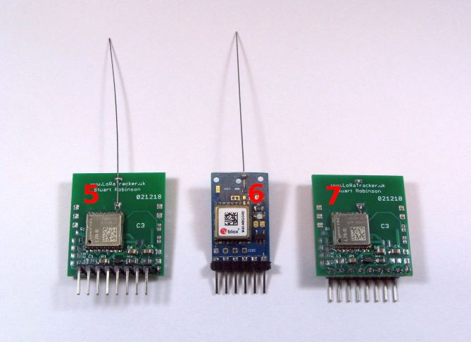
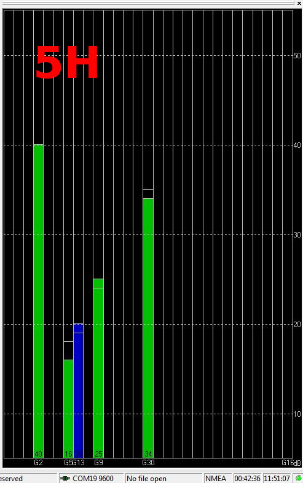
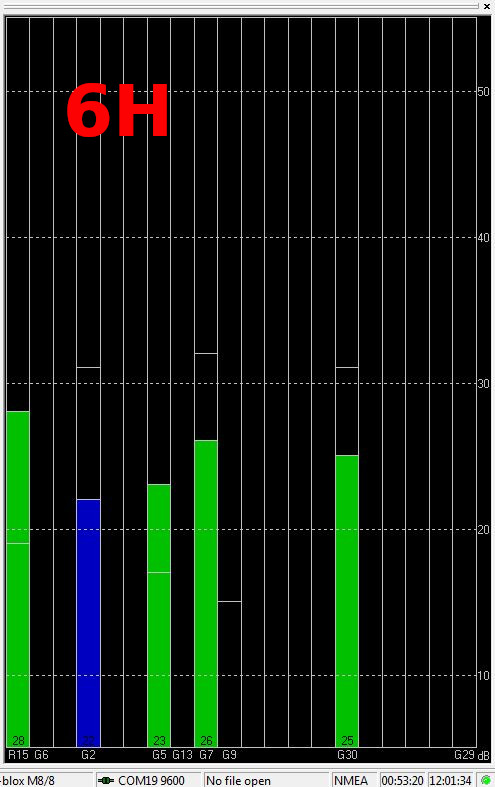
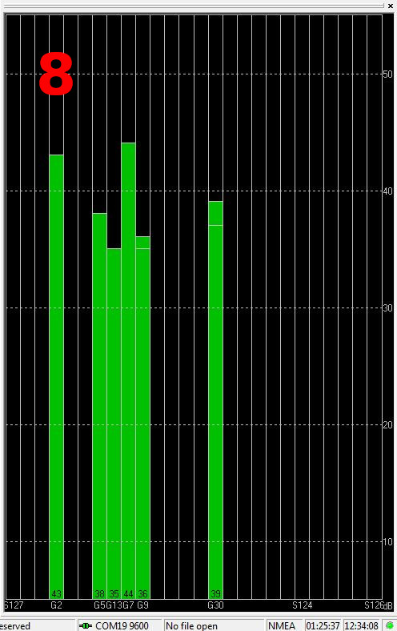

# GPS Performance 

GPS performance is an often overlooked issue. You may spend a lot of time concentrating on designing a GPS project with an extremely low  sleep current, without paying attention to the amount of power the GPS uses when it is running, acquiring a fix and when its in backup mode.

If a GPS in 'hot fix' mode consumes 50mA (typical figure) and takes and average of 5 seconds to get a new fix, and you do that every 10 minutes, then in one day it will consume;

50 x 5 x 6 x 24 = 36000maSecs 

or

10mAhr per day. 

Now 10mAhr over a day may not seem a lot, but if the batteries were a pack of AAs then battery life would be less than 280 days.

10mAhr a day is an average current of 416uA, so its rather pointless worrying whether a project consumes 10uA in sleep versus striving for 0.1uA or less. 

The issues around using a GPSs backup mode, which allows hot fix to operate, will be considered separately, but first I wanted to check the fix performance of a range of common GPS modules and comparing with two new GPSs breakout boards I have developed for the Quectel L70 and L80 GPS modules.

First I will measure the signal receiving performance the GPS. For this we will use the Ucenter application which when connected to a GPS produces a chart of satellite received satellites and their signal strengths. GPSs with a good signal performance will achieve initial lock quicker, work better in more marginal conditions and will overall require less power to operate. 

Ucenter uses the NMEA GSV sentence to obtain the signal strengths of the satellites;

*Signal strength, in dB-Hz (0 - 99)
To compare with SNR values found in Bin messages (such as Bin96) subtract 30 from this signal strength value for an approximate SNR value
SS - 30 = SNR (from Bin message)*

A signal level of 26 or lower is marginal and you may not get a fix, or it could take a long time. A value of 40 or more is a strong signal. if a GPS is receiving 3 or more satellites at this signal level or greater then it can be expected to aquire a fix in 30-50 seconds from cold.

The Ucenter application is designed for Ublox GPSs but it will display satellite information for other GPS makes also. 

In the roof of my shed I have a clear plastic panel and I placed the GPSs in turn underneath this on a high shelf. The location was not ideal for good GPS reception but indicative of a slightly marginal situation.

The GPSs were connected in turn and time was given for the GPS to acquire a fix, in some cases the time from cold to first fix was taken and the current consumption was also measured. 

This report is a work in progress, fix and current data is not yet available for some GPSs.

This is the first set of GPSs';

And the respective plots from Ucenter were are shown below, GPS 3 is a Ublox6M tested with the large ceramic patch antenna (3A) and the smaller one which is sometimes used (3B).

  

#### 1 - Ublox 7M GPS
Often used on quadcopters and similar, has 25mm ceramic patch antenna inside. 

 
  
  
#### 2 - Ublox8 GPS
With 25mm ceramic patch antenna. 

Fix time from cold, 35 seconds.
Current whilst acquiring fix, 50mA to 54mA.
Current after fix acquired, 45mA to 56mA.

  
#### 3A - Ublox6M GPS
With plug in  25mm ceramic patch antenna.
Fix time from cold, 35 seconds.
Current whilst acquiring fix, 50mA to 55mA
Current after fix acquired, 45mA to 55mA

  
  
#### 3B - Ublox6M GPS
With plug in  mini ceramic patch antenna. Much reduced signals. No fix.

  
#### 4 - unknown type.

  
**GPSs 5,6 and 7** below are typical types for high altitude balloon (HAB) tracking, all 3 have a high altitude mode allowing operation above 18,000M

  
  
#### 5H Quectel L70
With simple horizontal wire antenna. 
Fix time from cold, 32 seconds.
Current whilst acquiring fix, 14mA to 15mA
Current after fix acquired, 15mA to 22mA. The L70 is the same size and pin layout as the Ublox MAX8Q.

  
  
#### 5V Quectel L70
With simple vertical wire antenna. 
Fix time from cold, 36 seconds.
Current whilst acquiring fix, 14mA to 15mA
Current after fix acquired, 15mA to 22mA

  

#### 6H Ubloz MAX8Q
The standard HAB GPS perhaps. With simple horizontal wire.
Fix time from cold, 5 min 46 seconds.
Current whilst acquiring fix, 22mA to 28mA
Current after fix acquired, 20mA to 25mA
  

  
  
#### 6V Ublox MAX8Q
With simple vertical wire.
No fix acquired in 20 mins. 
Current whilst acquiring fix, 22mA to 28mA
fix in 5 min 46 seconds. With antenna vertical no fix acquired after 20 minutes. Current consumption whilst acquiring fix 22mA to 28mA. Not a good performer. 

  

  
#### 7 Quectel L70 
With 25mm ceramic patch on PCB rear.  
Fix time from cold, 30 seconds.
Current whilst acquiring fix, 14mA to 15mA
Current after fix acquired, **11.2 to 14.6mA**
 

  

The next 4 GPS tested are pictured below, no8 is a Quectel L80 module.

  

####  8 - Quectel L80 
With integral 15mm ceramic patch.  
Fix time from cold, 30 seconds.
Current whilst acquiring fix, 21.6mA to 28mA
Current after fix acquired, 21mA. 

#### To be continued
  
  

## Stuart Robinson
## www.LoRaTracker.uk
## December 2018
 